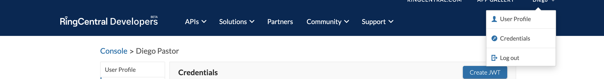
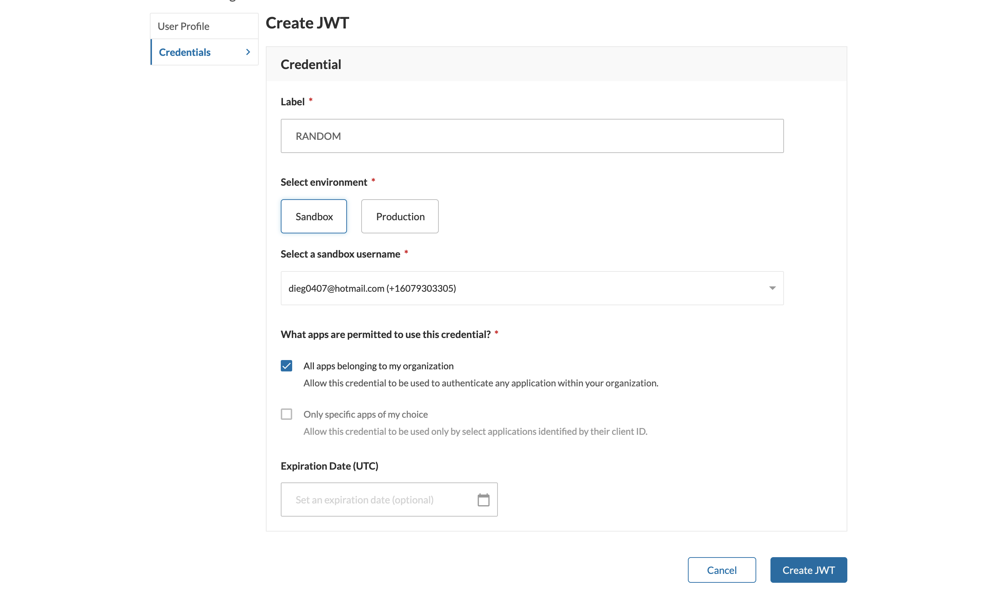
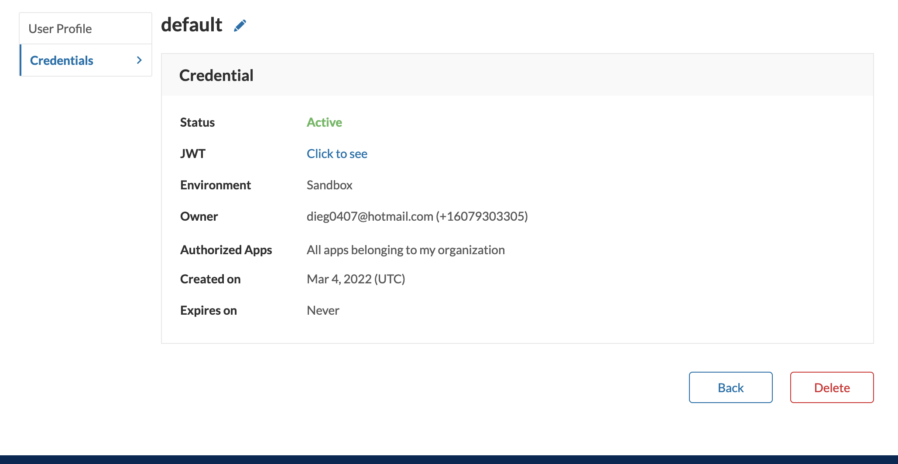
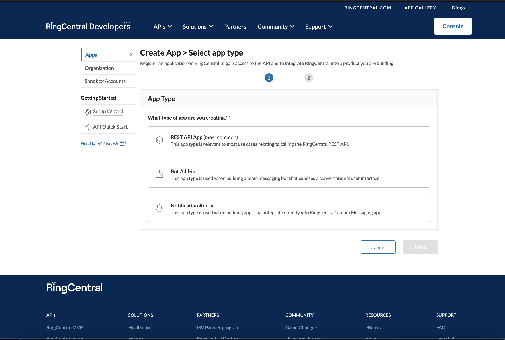
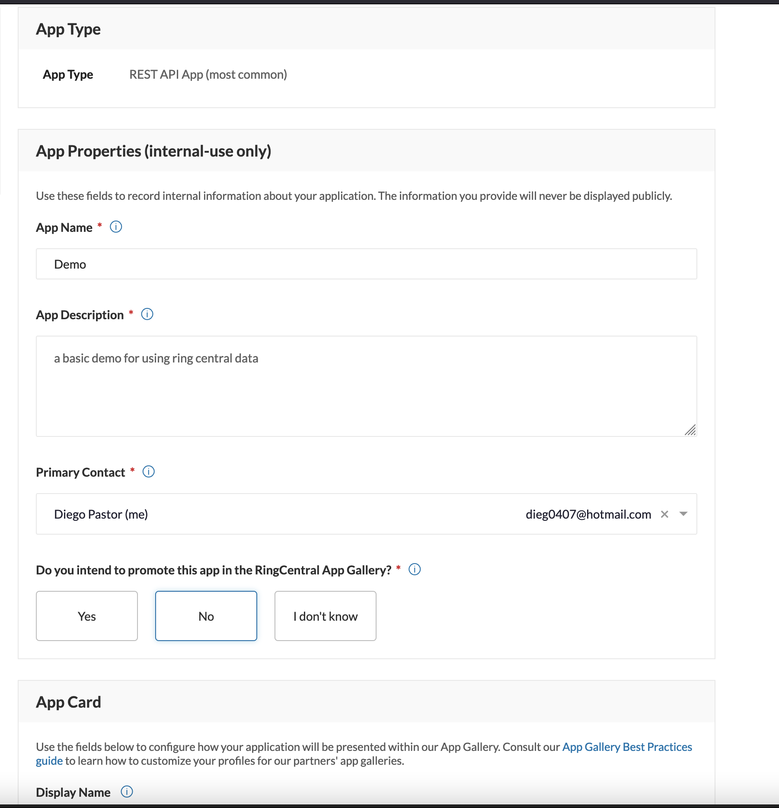
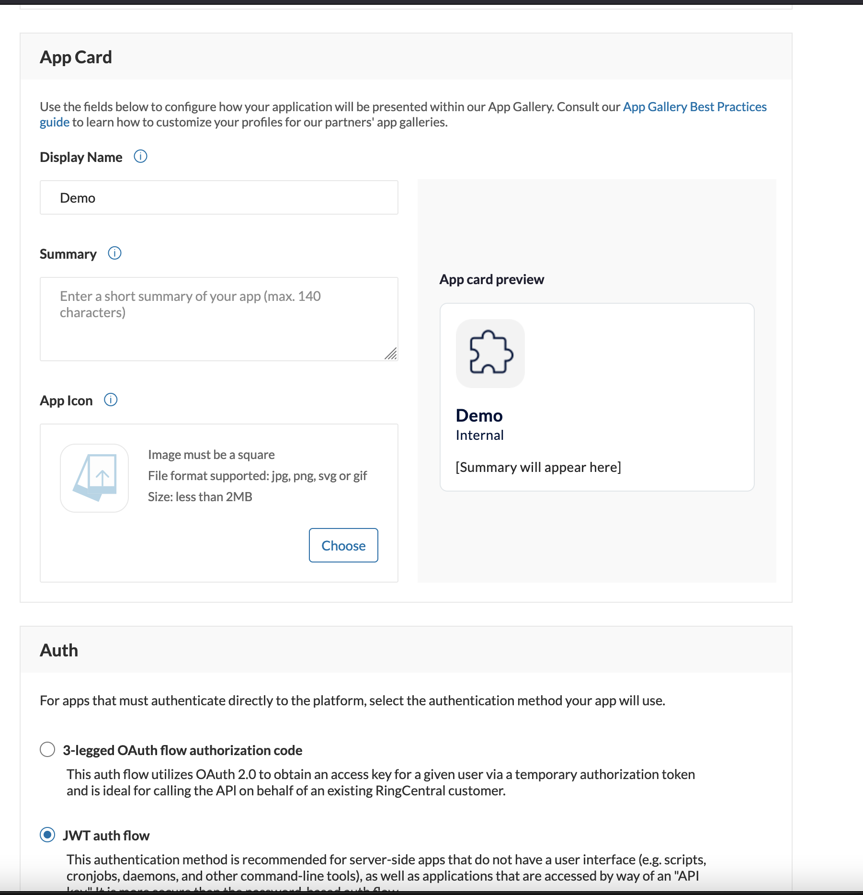
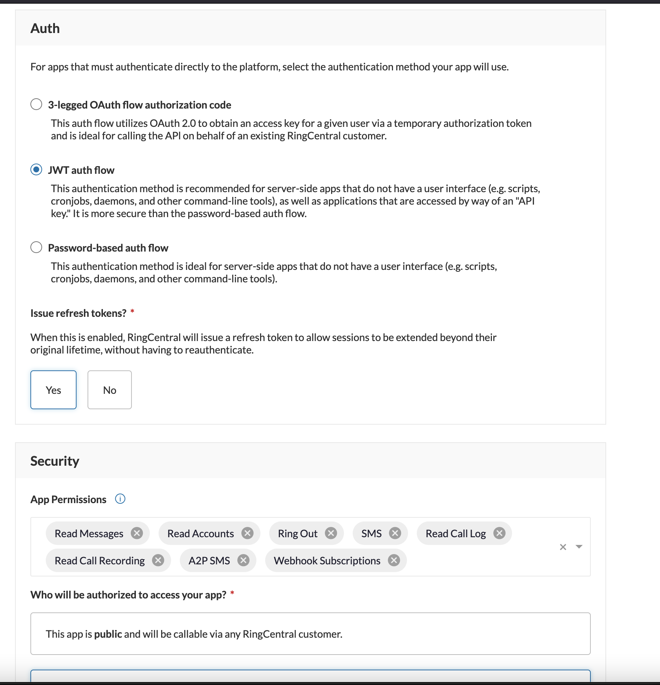
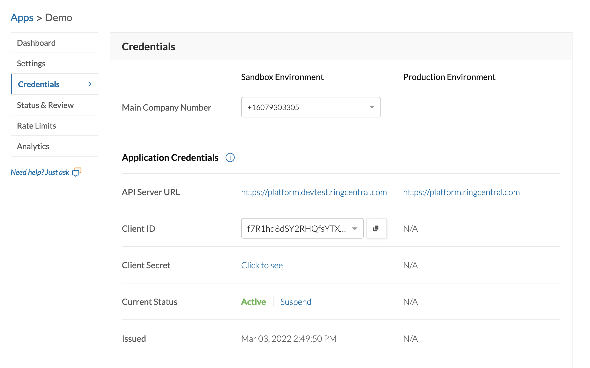
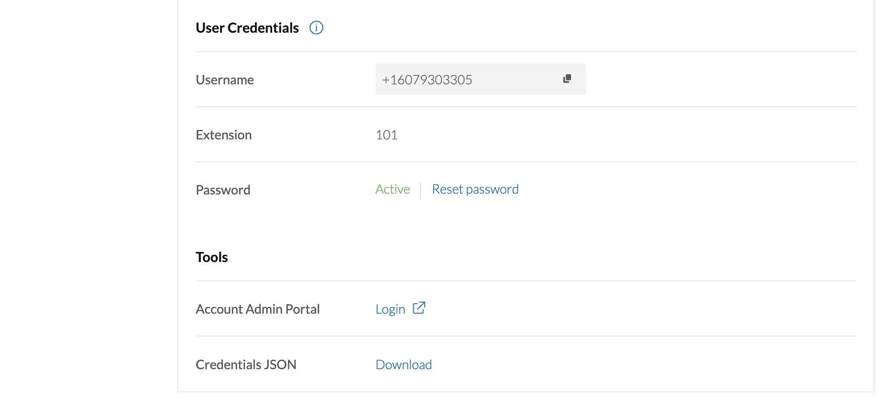

# About
This is a small wiki and demo for integrating with Ring Central using either Postman or the Java SDK.
It has an endpoint to create calls and to handle sms messaging.

# Configurations

## Account
Ring Central allows for the creation of a free developer account for dev and test purposes. There's one main constraint when using this type
of account, and that is that **only US numbers can be called, dialed, and forwarded**.

Once the account has been created you'll need to create and app and a Token for authentication either in the SDK or via API.

### Token
To create a jwt token for authZ and authO you need to go to the top on the profile menu and click on credentials.



Once there it's pretty straightforward, just check all apps that belogn to my organization and click on create.



That's all, you'll need the jwt value for the app configuration.



### App
To create an app you'll first need to define the type, in this case, as we're integration via API, we're going to use the `Rest Api type`



Most of the configuration is not important, so the name, description can be set to anything.




The important part are the `auth type` and the `app permisions`, if not configured corretly, then some operations will throw errors.
We're going to use `JWT auth Flow` and set permisions for reading accounts, `RingOut` (the call service), webhooks and SMS.



The last part needed for the configuration is being sure that the credentials information has the correct format and get some
extra info like the client secret.

From this part we need the **client secret**, **client id** and the **dev url** information.


And here we need to make sure that **password** is active and that the `credentials JSON` url downloads a field with a field called jwt.


## Spring API
Spring doesn't seem to have support for `RingCentral`, however the only thing we need to connect via sdk are the dependencies
and a `RestClient` that is authenticated.

### Dependencies
Using gradle you need the `ring central sdk` and the `okhttp3` dependency as the sdk uses it for it's internal rest calls.

```groovy
dependencies {
  // ....
	implementation 'com.squareup.okhttp3:okhttp:4.9.3'
	implementation 'com.ringcentral:ringcentral:2.8.2'
  // ....
}
```

### @Configuration
Regardings how to configure the app, it's up to the developer, the way it was done on this demo was add properties to the `application.yml`.

Then a `@Bean` was initialized with the `RestClient` object so that it could be used in any part of the api.

```yml
app:
  ringout:
    id: <The Client Id>
    secret: <The Client Secret>
    url: https://platform.devtest.ringcentral.com
    ext: '101'
    token: <The jwt token> 
server:
  port: 80
```

```java
@Configuration
public class RingoutConf {

    @Bean
    public RestClient ringCentralRestClient(RingoutProps props) throws IOException, RestException {
        final var client = new RestClient(props.getId(), props.getSecret(), props.getUrl());
        if (props.getToken() != null && !props.getToken().isBlank()) 
            client.authorize(props.getToken());
        else
            client.authorize(props.getUser(), props.getExt(), props.getPass());

        client.autoRefresh();

        return client;
    }

    @Bean(destroyMethod = "exec")
    public Shutdown shutdown(RingoutProps props) throws IOException, RestException {
        return new Shutdown(ringCentralRestClient(props));
    }

    @Slf4j
    @Value
    public static class Shutdown {
        private final RestClient restClient;

        public void exec() throws IOException, RestException {
            log.info("Calling revoke on ring central rest client");
            restClient.revoke();
        }
    }
}
```
### Hook setup
In short, as it's well documented, to create a webhook you need an endpoint that accepts json and an empty body for the first
sent. The first request must return the validation token sent to the hook so that it can be accepted.

```java
@PostMapping(path = "/hook", consumes = MediaType.APPLICATION_JSON_VALUE, produces = MediaType.APPLICATION_JSON_VALUE)
public ResponseEntity<?> hook(@RequestBody(required = false) String body,
    @RequestHeader(name = "Validation-Token", required = false) String validation) {
        
    if (body == null)
        return ResponseEntity.ok()
            .header("Validation-Token", validation)
            .build();
    else
        log.info(body);

    return ResponseEntity.ok()
        .build();
}
```
**OBS:** to test the webhook `RingCentral` recommends the usage of a tunnel such as `https://ngrok.com/` which also allows the
creation of a free account with the only caviat that everytime the service is started, a new url is generated for the tunnel.
 
## API setup
To use the API endpoints first we need to login using our JWT credentials to get an access token. The steps we need to take are as follows.

1. Create a `POST` request to this url `[BASE]/restapi/oauth/token` where `[BASE]` is the url for the dev or prod environment.
2. Add an `Authorization` header with the content `Basic [ENCODED]` where `[ENCODED]` is a Base64 encoded string, this string,
must follow the format `[CLIENT_ID]:[CLIENT_SECRET]`.
3. The body must be of type `application/x-www-form-urlencoded` and it must contain this two parameters:
`grant_type=urn:ietf:params:oauth:grant-type:jwt-bearer` and `assertion=[JWT]` where `[JWT]` is your personal JWT credential.

If everything was done correctly, then you should get the access token on the json response body after the POST. Once that's done 
then you can use `Authorization: Bearer [ACCESS_TOKEN]` to access any endpoint.

## Hooks
All hooks must be configured using the endpoint `/restapi/v1.0/subscription`, the list of webhooks are on the docs section.
An example for hooks related to SMS can be:

```json
{
  "eventFilters": [
    "/restapi/v1.0/account/~/extension/~/message-store?direction=Inbound&messageType=SMS"
  ],
  "deliveryMode": {
    "transportType": "WebHook",
    "address": "https://7319-38-25-17-223.ngrok.io/call/hook"
  }
}
```

This configuration will allow us to get all inbound (responses) sms messages.

### SMS
For `SMS` the url to be used is message store `/restapi/v1.0/account/~/extension/~/message-store`. The parameters can be defined
as `message store` is also used for fax and voice mailing.

### Calls
For `calls` the url that can be used can be either:
* `/restapi/v1.0/account/~/extension/~/telephony/sessions`
* `/restapi/v1.0/account/~/telephony/sessions` 

# Docs
* [SDK reference](https://developers.ringcentral.com/guide/voice/ringout)
* [Java SDK Github page](https://github.com/ringcentral/ringcentral-java)
* [API reference](https://developers.ringcentral.com/api-reference)
* [JWT Auth Flow](https://developers.ringcentral.com/guide/authentication/jwt-flow)
* [WebHooks](https://developers.ringcentral.com/guide/notifications/webhooks/creating-webhooks): We can access hook information
either creating and endpoint `push mechanism` or using **PubNub** `pull mechanism`