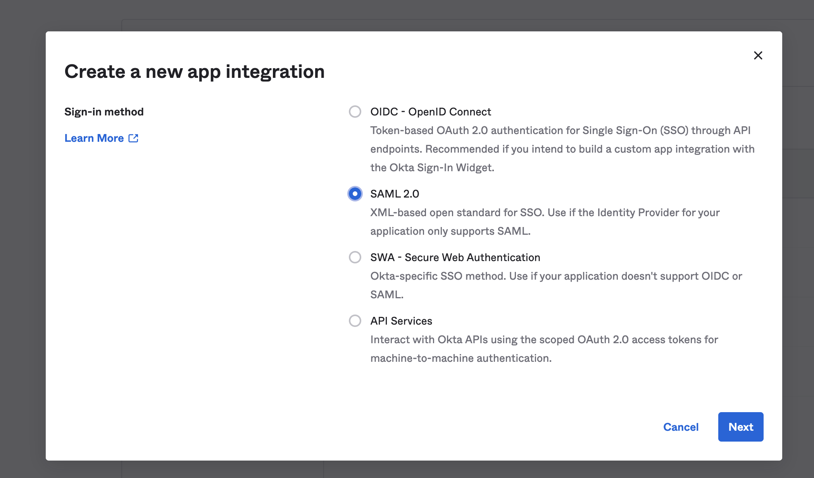

# About

This is a sample project to create a service that authenticates with the SAML2.0 dependencies provided
by Spring security and serves and endpoint to a react front end application that fetches some information
about the user that has been authenticated. The react app will only access such resources if the user
is authenticated.

# Stack

1. Spring Boot
2. React
3. Okta (as the identity provider)

The versions can be seen on the sub projects

# Setup

In order to make this work, we first need to setup and IDP that will handle the authentication with the users credentials.
There're many different vendors that provide such functionallity, but in this scenario we're going to setup Okta as the IDP.

## Setting up Okta

First we need to create a developer account. To do that go to [https://developer.okta.com/](https://developer.okta.com/) and sign up with any of the provided options.

Once registered, we need to create and application with SAML 2.0.



For the first part we do this selection


The tricky part comes in the SAML configuration as this will define how okta interacts with the application.


`The single sign on URL` is the url in which the XML with the user info and assertions are going to be sent once the user is authenticated on the IDP. In this case, the default configuration is `http://localhost:8080/login/saml2/sso/okta`. **The 'okta' at the end of the url is a configurable name on the back end side**

Secondly, `the Audience URI` will identify this application, it's the entity id and it can be whatever you may want. However, it's better to use the address of the service + an identifier. For the example we used `http://localhost:8080/test-1232432894` as localhost:8080 is the base url and the identifier is the part that comes after the '/'.

Thirdly we handle the `Name ID format`, this will stablish what will be de the id of the user that will be sent with the assertion to the back end service. We choose EmailAdress, but in theory it cab be any of the options provided by okta.

That's the minimal amount of configuration needed, however, if you want to configure the **single logout** the click on advanced.


In this part we care for three things:

1. **Single Logout URL**: By default it will resolve to this url: `http://localhost:8080/logout/saml2/slo`. Notice how the `okta` part is not defined, and that is because it's not necessary for this.

2. **SP Issuer**: It would be basically the entity id, as such it should've the same value as the Audience URI.

3. **Signature Certificate**: All requests and responses sent from the IDP to the SP or the other way around are signed. In this case, this asks for the public certificate so that the IDP (Okta) knows that this logout request is actually comming from the SP (our backend). It's on the resources folder in the `login-backend` project.

Finally we mark this and click on finish:


That will handle the creation on the IDP side, however we're going to need some information to configure our SP.

To do that check de application details.


Here we can see either the view saml instructions, that will give the certificate and other information necessary for configuration.

Or, in the case of spring, we can click on the `Identity Provider Metadata` that will give us a link to the XML with all the metadata that we'll be using on our backend.

That XML looks like this one:


## Setting up Spring Application

### Build Configuration

The build definition is pretty straightforward and it's
based on the one found in the official example for saml
2.0 provided in this [url](https://github.com/spring-projects/spring-security-samples/tree/main/servlet/spring-boot/java/saml2/login). With some differences on
the versions.

### Properties Configuration

Being a spring boot app, most of the configuration can be done with properties.
The full yaml can be seen on the back but the most important configurations are as follows:

```yaml
spring:
  security:
    saml2:
      relyingparty:
        registration:
          okta: #1
            entity-id: http://localhost:8080/test-1232432894 #2
            signing.credentials: #3
              - private-key-location: classpath:credentials/rp-private.key
                certificate-location: classpath:credentials/rp-certificate.crt
            identityprovider: #4
              metadata-uri: https://dev-06211481.okta.com/app/exk3p0fe9rl0FeWBT5d7/sso/saml/metadata
```

The `#1` is the identifier of the IDP, it's possible to have more than one in one application. As such, each one must be defined with a different name. This configuration will also define the final part of the url `http://localhost:8080/login/saml2/sso/okta`.

`#2` defines the entity id that is configured on the IDP for the SSO and SLO. It can be whatever one may want.

`#3` defines the credentials to sign our request and responses in the SAML flow.

`#4` defines the IDP configuration from the back end service. It can be done manually getting the certificate and other variables as properties. Or, if the IDP supports it, one can just pass the metadata url and spring will handle the rest.

### Bean Configuration

To handle some more specific configurations we do them programmatically.


On the image, the first configurations is the base for the security. We add saml2Login and saml2Logout for every endpoint on our application.

The second configuration will take the IDP registration on our properties and make them avaiable to be discovered.


For the previous image, just as the IDP provides us with metadata on an URL. We too can provide the same metadata on an URL. To do that we add a filter that allows free access to the endpoint `/saml2/service-provider-metadata/{registrationId}` where registrationId will be `okta` for our case.

The second configuration is for CORS on the front end.

### Endpoints

As this is a demo the application will have two controllers. One MVC and one Rest.

The MVC Controller will handle a redirect to the react app when the user is authenticated and also has a logout endpoint that provides with a logout form that autosubmits on load. This is done because the logout is also secured with a CSRF and if done from the front it crashes.


The Rest Controller on the other side will return the user id that was federated with saml once the session is created and the user authenticated.


### React

For the react application there's not much going on. What this will do is try to fetch data from the Rest API. If not able, it will redirect to the login page on the backend wich in turn will redirect them to the okta provider.

Once this is done and the user is authenticated, the IDP will redirect to the default root of the app which in turn will redirect to React only that this time, as the session has been created (with the server side cookie). The api call will suceed and show the user info.

**After redirection**


**After successfull login**


**After logout button clicked**


Code snippet from react to do the work:


